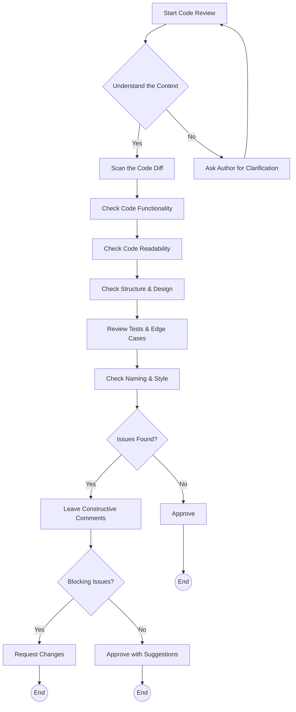

# 🧑‍💻 Code Reviews

Code reviews are a foundational practice in modern software development.\
After the chapter on [Pull Requests](./handbook-pull-requests.md), this chapter focuses on how to effectively review code itself, provising practical tips for reviewers.

## The Purpose of Code Reviews

Code review is about more than finding bugs, it's a conversation about design, readaility and maintanability.

**Why review code?**

- **Catch issues** before they reach production
- Ensure code aligns with **team and project standards**
- **Spread knowledge** across the team
- Foster **shared ownership** of the codebase

## What to look for

When reviewing code, think behond "does it work?" and consider the following:

### Functionality
- Does the code do what the feature fix says it should?
- Are there **edge cases** that may break it?

### Readability
- Is the code **easy to understand**?
- Would someone unfamiliar with the codebase be able to follow it?

### Structure & Design
- Are the **naming conventions** consistent?
- Could logic be **simplified** or **refactored** for clarity?
- Can the code be **reused** or **extended**?

### Tests
- Are there **unit tests** for the new code?
- Do they cover both normal and edge-case scenarios?

### Style
- Is the formatting **consistent** with the rest of the codebase?
- Are there any **linting errors**?

## Reviewing Process

A structured approach leads to more effective code reviews. Here's a simple process to follow:

### Step-by-Step Review Flow

1. **Understand the context**
   - Read the **PR description** and **linked issues**
   - Check the **requirements** and **acceptance criteria**

2. **Scan the diff**
    - Get a sense of the **scope**
    - Are there too many changes in one PR?

3. **Review the code**
    - **Run the code** locally if possible
    - Step through it as the runtime would

4. **Leave actionable comments**
    - **Ask questions** to clarify intent
    - **Suggest improvements** or **alternatives** and explain why something might be improved

5. **Avoid personal preferences**
    - Focus on **objectivity** and **code quality**
    - **Explain your reasoning** for each comment
    - If it's not a breaking issue or part of a convention, consider letting it go

## When to Approve

You're not looking for perfection, but for **quality** and **consistency**.\
The goal is to ensure the code aligns with quality standards and maintainability.

Approve the PR when:
- You understand **what the code does**
- The design is **clear and maintainable**
- Any raised concerns are **addressed or explained**

If something's unclear, it is better to ask before you approve.\
Silence doesn't mean consent, clarity does.

## Culture of Respect

- Review the code, not the coder
- Ask questions rather than making accusations
- Give the benefit of the doubt
- Be open to being wrong

## Simple Flowchart for Code Reviews

## Sources & References

- [SmartBear: Best Practices for Peer Code Review](https://smartbear.com/learn/code-review/best-practices-for-peer-code-review/)
- [GitHub Docs: About Pull Request Reviews](https://docs.github.com/en/pull-requests/collaborating-with-pull-requests/proposing-changes-to-your-work-with-pull-requests/about-pull-request-reviews)
- Personal experience in SCRUM collaborative teams
